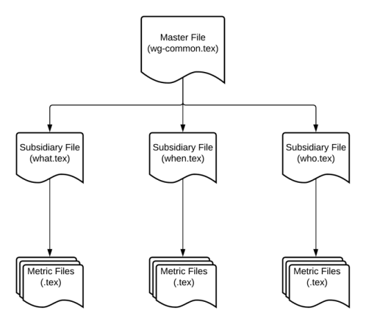
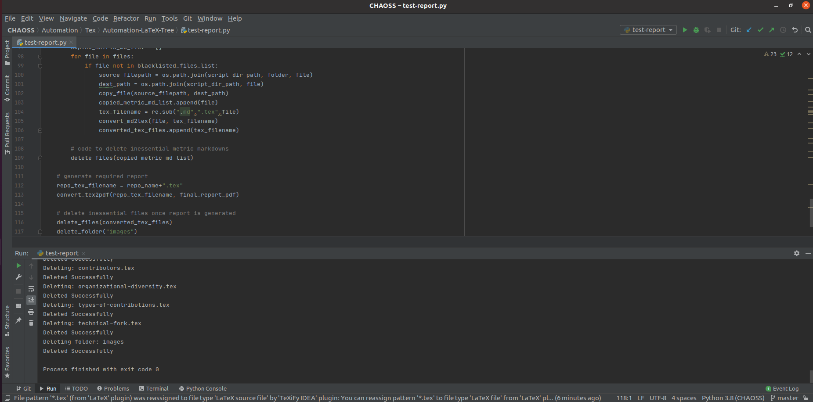

# Automated Report Generation: Tree Structure

The system works by creating a tree of the required working group. For each level a LaTeX file is used to include the files under it.

This automation system can be used to automate the process of creating a report of the metrics released by a particular working group.

## Pre-Requisites

- Same as in this [automation system.](../Automate-WG-Report#pre-requisites)

## Files

- Script used to generate the report : [test-report.py](test-report.py)
- File used for formatting: [header.tex](header.tex)
- Cloned Repository : [wg-common](wg-common)
- Additional Files:
    - Master file : [wg-common.tex](wg-common.tex)
    - Subsidiary files:
        - [what.tex](what.tex)
        - [when.tex](when.tex)
        - [who.tex](who.tex)      

## Structure

- This automation system functions mainly on three levels.
    1. Master file (working group).
    1. Subisidiary files (defined for each focus-area).
    1. Converted Metric Files in LaTeX format.
- The master file includes the subsidiary files using LaTeX commands (\include{}). 
- The subsidiary file, for each focus area include those LaTeX metric files(obtained by conversion of each metric markdown file to LaTeX) which are defined under it.

## Report Generation Process

### Cloning the Remote Repository

- Same as in this [automation-system](../Automate-WG-Report#cloning-the-remote-repository) 

### Extraction of Files & Conversion to LaTeX

- The markdown files are first extracted from the required focus-area.
- These markdown files for a particular focus area are converted to LaTeX file format.
- The same process is repeated for each focus area.
- At the end of this we process, the required metric files are generated automatically in LaTeX format.
- Note:-  The extraction of these files is done automatically assuming that the repository follows the [standard template](https://docs.google.com/document/d/1chPzgJa49sO_f3wVqp_NLJupSVyKHSVyuFuwzl4m4KI/). 

### Conversion to PDF

- The master file is then converted to PDF. The conversion of this file results in a chain conversion of all the included LaTeX files.
- Thus, the resultant PDF generated contains all the metrics which are defined in a working group.  
- [**Link to Generated Report**](test-release.pdf)
- Note:- The front-matter will be replicated in LaTeX and prepended to the report soon.

### Removal of Inessential Files

- The report generation creates some intermediate markdown files and LaTeX files.
- These files are removed automatically once they're no longer needed. 

## Execution

- To test the process of report generation, run [test-report.py](test-report.py) in this folder itself.
- This above defined processes will start taking place in a step wise manner.
- Some intermediate files will be generated when the code is executed,these will automatically get deleted once the report gets generated.
- Output similar to the following screenshot would indicate successful execution of program:

