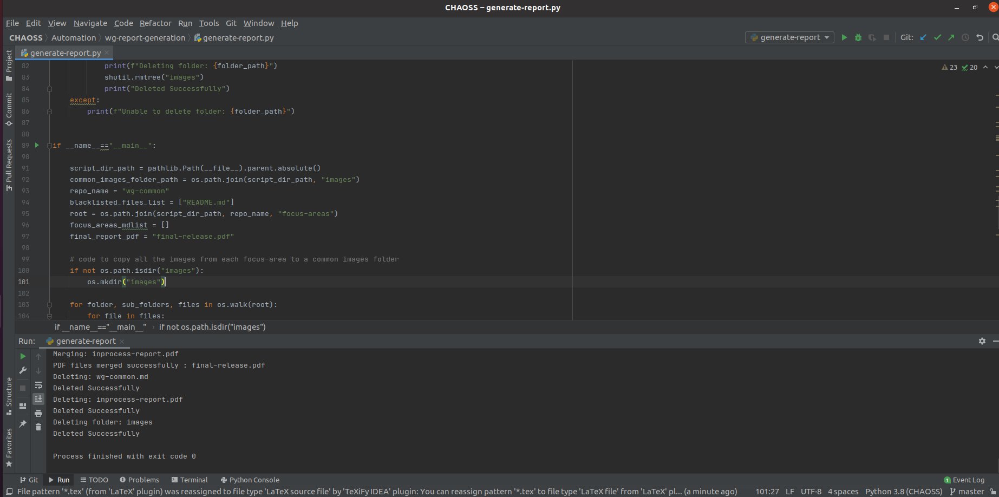

# Automated Report Generation for WG

The automated system can be used create a report of the metrics which are defined under a particular working group. The details of the automation system have been described below.

## Pre-Requisites

- [Pandoc](https://pandoc.org/installing.html)
- [PyPandoc](https://pypi.org/project/pypandoc/)
- [PyPDF2](https://pypi.org/project/PyPDF2/)
- [Git-Python](https://pypi.org/project/GitPython/)
- LaTeX Distribution

## Files

- Script used to clone the required repository : [clone-repo.py](clone-repo.py)
- Script used to generate the report : [generate-report.py](generate-report.py)
- Front matter of the report: [front-matter.pdf](front-matter.pdf)
- File used for formatting: [header.tex](header.tex)
- Cloned Repository : [wg-common](wg-common-copy)

## Report Generation Process

The automated system generates the required report by working in a stepwise manner. The system performs the following set of tasks to generate the report.

### Cloning the Remote Repository

- The [wg-common](https://github.com/chaoss/wg-common) was selected as the test repository for this process.
- The repository is cloned using the [clone-repo.py](clone-repo.py) script.
- Minor changes were made to the markdown files of the repository after cloning such as adding proper line-spacing, removal of unnecessary line breaks, etc.
- These edits ensure that the markdown files are displayed correctly in the report. (These edits can be made permanently in remote repositories.)

### Extraction of Files & Merger of Markdowns

- From the cloned version of the repository the required metric markdown files for each focus area are extracted.
- Sorted alphabetically, these files are merged to form a single markdown file for each focus area.
- The files for each focus area are once again sorted alphabetically and merged to form a single markdown file for the repository.
- Note:-  The extraction of these files is done automatically assuming that the repository follows the [standard template](https://docs.google.com/document/d/1chPzgJa49sO_f3wVqp_NLJupSVyKHSVyuFuwzl4m4KI/). 

### Conversion to PDF & Front Content Incorporation

- The merged markdown file thus obtained is converted to PDF.
- The process of conversion is unaltered and the same as described in [Microtask -3](../Microtask-3).
- The [front-content](front-matter.pdf) is then prepended to the generated PDF to create the final report.
- [Link to Final report](final-release.pdf)

### Removal of Inessential Files

- The report generation creates some intermediate markdown files and process.
- These files are removed automatically once they're no longer needed.

## Execution

- To test the process of cloning, run [clone-repo.py](clone-repo.py) script in any folder.
- To test the process of report generation, run [generate-report.py](generate-report.py) script in this folder itself.
- Output similar to the following screenshot would indicate successful completion of program:

