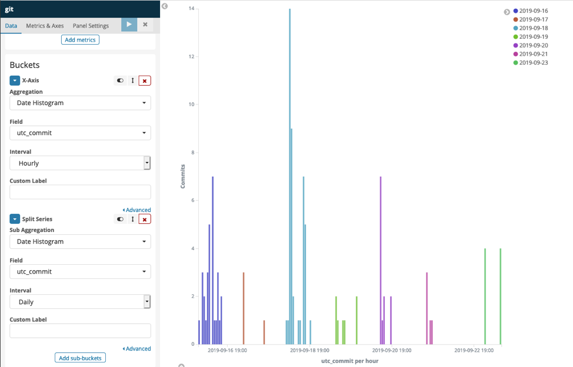

# Fechas y horas de actividad

Pregunta: ¿Cuáles son las fechas y las marcas de tiempo en las que ocurren las actividades de los contribuyentes?

## Descripción

Las personas participan en actividades en proyectos de código abierto en varios momentos del día. Esta métrica tiene como objetivo determinar las fechas y las horas en las que se completaron las actividades individuales. Los datos se pueden usar para estimar probabilísticamente de dónde provienen las contribuciones en los casos en que la zona horaria no sea UTC.

## Objetivos

* Aumentar la transparencia para los empleadores sobre cuándo participan los empleados de la organización en proyectos de código abierto
* Aumentar la transparencia para los gerentes de proyectos de código abierto y de comunidad respecto a cuándo ocurre la actividad

## Implementación

### Filtros
* Individuo por organización
* Agregación de tiempo por hora UTC
  - Puede mostrar en qué momento se realizan contribuciones en todo el mundo; cuándo está más activo el proyecto.
* Agregación de tiempo por hora local
  - Puede mostrar a qué horas del día de su zona horaria contribuyen. Conclusiones sobre el si se producen más contribuciones durante el horario laboral, o si por el contrario las contribuciones aumentan durante las horas de la tarde.
* ID de repositorio
* Segmento de una comunidad (por ejemplo, GrimoireLab tiene más actividad en las zonas horarias de la UE y Augur más actividad en las zonas horarias de EE. UU.)

### Visualizaciones

### Herramientas que proporcionan la métrica

[GrimoireLab](https://chaoss.github.io/grimoirelab/)

[Fecha/Marcas de tiempo de Augur](https://docs.augur.net/#dates-timestamps)

## Referencias

[Hora universal coordinada](https://en.wikipedia.org/wiki/Coordinated_Universal_Time)
