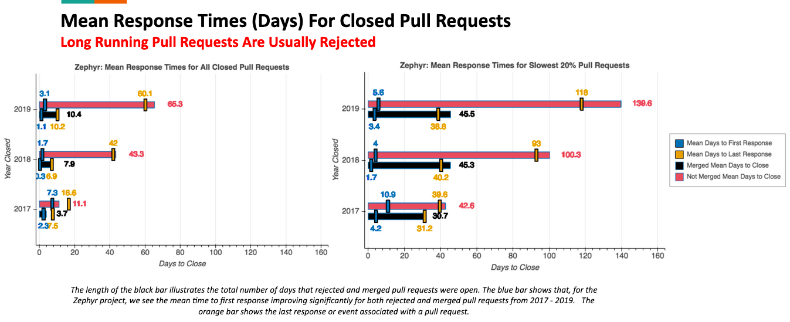

# Tiempo hasta la primera respuesta

Pregunta: ¿Cuánto tiempo pasa entre que se crea una actividad que requiere atención y la primera respuesta?

## Descripción

La primera respuesta a una actividad a veces puede ser la respuesta más importante. La primera respuesta muestra que una comunidad es activa y participa en conversaciones. Un tiempo prolongado para responder a una actividad puede ser una señal de que una comunidad no es reactiva. Un breve período de tiempo para responder a una actividad puede ayudar a involucrar a más miembros en más discusiones y dentro de la comunidad.

## Objetivos

Identificar la cadencia de la primera respuesta a través de una variedad de actividades, incluidas PRs, incidencias, correos electrónicos, publicaciones de IRC, etc. El tiempo hasta la primera respuesta es una consideración importante para los contribuyentes nuevos y antiguos a un proyecto junto con el estado general del proyecto.

## Implementación

Tiempo hasta la primera respuesta de una actividad = hora en que se publicó la primera respuesta a la actividad - hora en que se creó la actividad.

### Filtros

* Función del respondedor, p. ej., solo se cuentan las respuestas de mantenedores
* Respuestas automatizadas, por ejemplo, solo se cuentan las respuestas de personas reales mediante el filtrado de bots y otras respuestas automatizadas
* Tipo de actividad, p. ej., incidencias (consulte la métrica [Tiempo de respuesta ante incidencias](https://github.com/chaoss/wg-evolution/blob/master/metrics/Issue_Response_Time.md)), correos electrónicos, chat, revisiones de códigos

### Visualizaciones

---------

---------

### Herramientas que proporcionan la métrica

* Panel de GrimoireLab: [Descripción general del tiempo de eficiencia](https://chaoss.github.io/grimoirelab-sigils/panels/efficiency-timing-overview/)
* [Panel de eficiencia del tablero de Kata Containers](https://katacontainers.biterg.io/app/kibana#/dashboard/cbbdd920-288c-11e9-b662-975152e57997)

## Referencias

